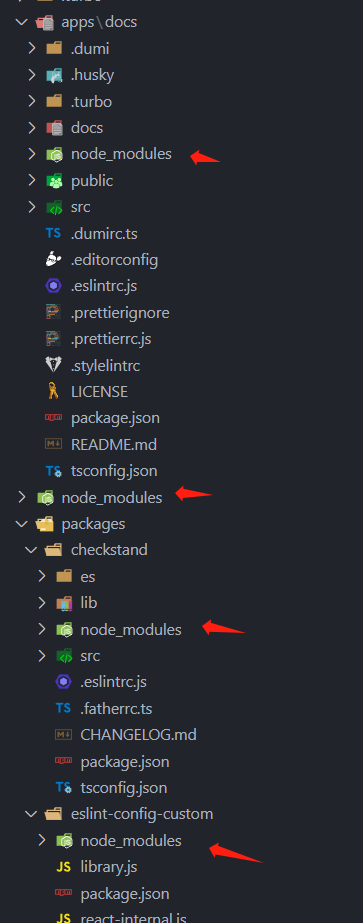
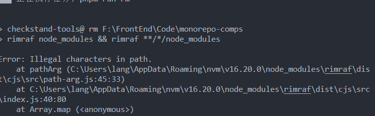
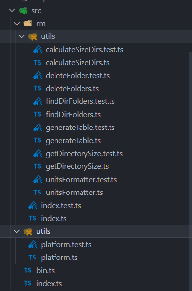
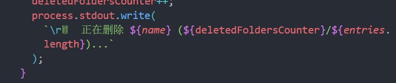
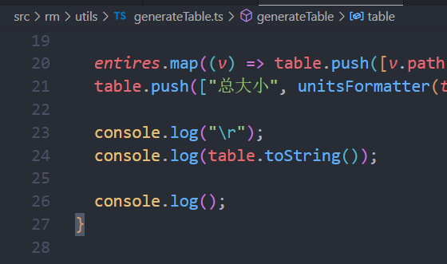
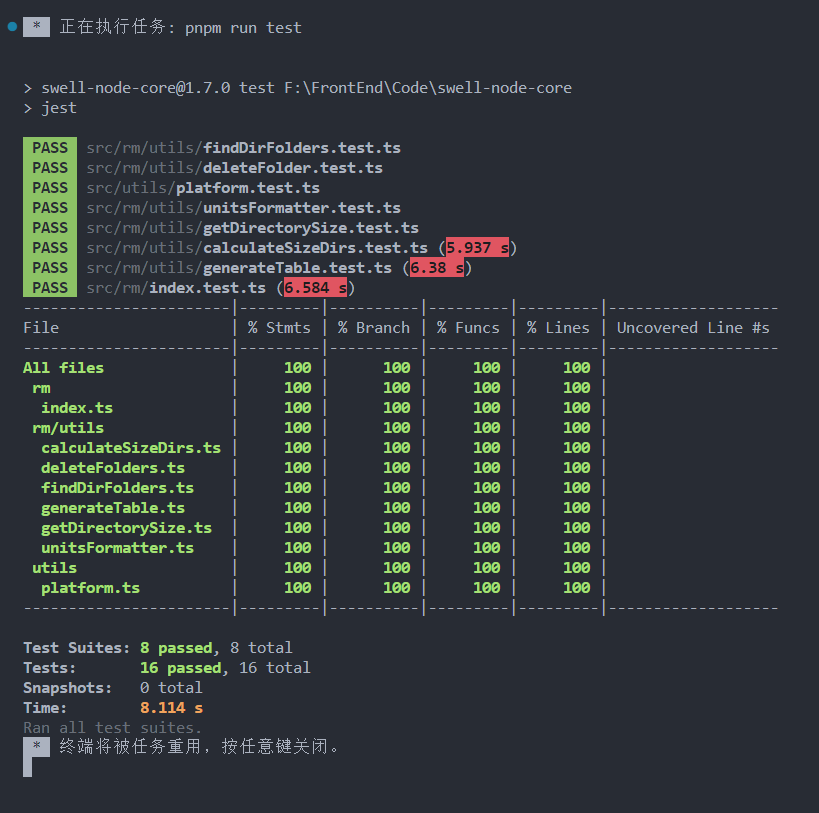

# Node 工具删除文件夹命令


## 初衷

说下开发这个 node 工具库的来由, 之前是在写一个 monorepo 的业务组件库, 然后项目里面有好几个库, 每个库在 pnpm 安装依赖的时候会有 node_modules



一开始我是使用 rimraf

```js
rimraf node_modules && rimraf **/*/node_modules
```

然后也尝试过另外两种

删除目录中所有找到的 node_modules

警告！这个步骤会删除所有名字为 node_modules 的文件夹
进入目录
　 cd workplace
linux 中删除

```js
find . -name "node_modules" -type d -prune -exec rm -rf '{}' +
```

windows 中

```js
FOR /d /r . %d in (node_modules) DO @IF EXIST "%d" rmdir /s /q "%d"
```

上面的方法在某些特定场合都是可以的, 但是需要区分环境, 而且还可能会报错, 比如说在 window 下执行 rimraf



当然不是说错误不能修复, 但是需要去调研排查, 不易长期稳定使用

正好我准备写一个 node 插件集合方便以后开发使用, 就做一个批量删除项目子应用的指定文件夹


## 搭建

这里我采用之前没有使用过的 [unbuild](https://github.com/unjs/unbuild)

[unbuild](https://github.com/unjs/unbuild) 基于 Rollup，集成了 Rollup 生态中非常优秀的插件，开箱即用的支持 `typescript`，并允许生成 `commonjs` 和 `esmodule` 格式和类型声明。

在项目根目录新建文件 `build.config.ts`

```js
import { defineBuildConfig } from "unbuild";

export default defineBuildConfig({
  // 需要打包的入口
  entries: ["src/index", "src/bin", "src/utils/platform.ts"],
  clean: true,
  outDir: "bin",
  declaration: true,
  rollup: {
    // emitCJS: true, // 不支持cjs 因为 chalk这种第三方依赖的版本只支持 ESM
    esbuild: {
      // minify: true,
    },
  },
});
```

这里为啥不生成 cjs 的打包文件, 因为我用的第三方的依赖最新版本默认都已经支持 ESM 模式

所以如果打包成 cjs 的模块, 去 require 这些包的时候其实是执行报错, 解决方案就是将第三方依赖的版本号降级到支持 cjs 的版本, 但是其实没必要.

因为 ECMAScript 模块是 JavaScript 的标准模块系统，它使用 import 和 export 关键字来导入和导出模块。它可以在 Node.js 环境下和现代浏览器环境中使用，具有更好的跨平台兼容性和可移植性。Node.js 从版本 12 开始支持 ECMAScript 模块作为实验性功能，并在版本 14 中正式支持。所以我们不需要非要打包 cjs 模块

项目的目录结构如下:



我们可以看到, 入口的文件有两个, 一个是 bin 一个是 index, 原因是因为这个 node 项目不仅支持终端调用命令执行方法也支持代码引入的方法执行命令

当然这些不是重点, 重点的代码主要是在 src/rm/utils 下, 在写执行删除文件夹的功能中, 封装了很多方法, 并且针对这些方法都写了对应的单元测试, 而且覆盖率都保证是在 100%, 保证我们的项目执行的稳定性

文章后面也会花篇幅着重介绍如何编写 node 的测试用例

## 开发

我们先来看下效果


首先我们会执行命令 然后会去执行删除指定的文件夹, 并记录每个文件夹的大小, 最后通过表格的形式展示在终端展示出来路径和大小

首先我们先整理看下删除指定文件的入口方法 `rmDir`, 并逐一分析里面用到的方法

```ts
import chalk from "chalk";
import ora from "ora";
import path from "path";
import { deleteFolders } from "./utils/deleteFolders";
import { findDirFolders } from "./utils/findDirFolders";
import { calculateSizeDirs } from "./utils/calculateSizeDirs";
import { generateTable } from "./utils/generateTable";

// 获取node进程的工种目录
const cwd = process.cwd();
const dirName = path.resolve(cwd);

// 默认删除 node_modules 文件夹
export async function rmDir(name = "node_modules") {
  const spinner = ora(`删除 ${name} 中`).start();

  try {
    // 递归查询所有符合标准的文件夹路径
    const dirs = await findDirFolders(dirName, name);

    if (dirs.length === 0) {
      console.log(chalk.yellow(`\r😖 ${dirName} 不存在 ${name}`));
      process.exit();
    }

    // 查询需要删除的文件夹大小和总大小
    const { entires, totalSize } = calculateSizeDirs({ dirs });
    // 异步执行删除文件夹
    await deleteFolders(dirs, name);

    await setTimeout(() => {
      spinner.succeed(chalk.green("删除成功"));
      // 基于需要删除的文件夹大小和总大小生成表格
      generateTable({ entires, totalSize });
    }, 500);
  } catch (error) {
    spinner.fail(`${chalk.red("删除失败 => ")}${chalk.redBright(error)}`);
  } finally {
    spinner.stop();
  }
}
```

以上就是整体的执行逻辑, 我们整理下总共用到了哪些方法

| 方法名                                                                                                          | 功能                                               |
| --------------------------------------------------------------------------------------------------------------- | -------------------------------------------------- |
| [findDirFolders](https://github.com/18355166248/swell-node-core/blob/main/src/rm/utils/findDirFolders.ts)       | 递归查询所有符合标准的文件夹路径                   |
| [calculateSizeDirs](https://github.com/18355166248/swell-node-core/blob/main/src/rm/utils/calculateSizeDirs.ts) | 查询需要删除的文件夹大小和总大小                   |
| [getDirectorySize](https://github.com/18355166248/swell-node-core/blob/main/src/rm/utils/getDirectorySize.ts)   | 获取需要删除的文件夹大小                           |
| [deleteFolders](https://github.com/18355166248/swell-node-core/blob/main/src/rm/utils/deleteFolders.t)          | 异步执行删除文件夹                                 |
| [generateTable](https://github.com/18355166248/swell-node-core/blob/main/src/rm/utils/generateTable.t)          | 基于需要删除的文件夹大小和总大小生成表格           |
| [unitsFormatter](https://github.com/18355166248/swell-node-core/blob/main/src/rm/utils/unitsFormatter.t)        | 基于获取需要删除的文件夹大小转成指定 MB 和 GB 文本 |

## 测试

测试这块使用了 [jest](https://jestjs.io/docs/api)

其实写测试用例之前, 我也没有写过很多 node 测试用例, 所以 api 这块真的只能靠查文档, 毕竟记不住, 所以大家第一次写测试用例的时候不要怕写不好, 有耐心, 有目标的学习知识点就行, 记不住不熟悉是很正常的时期


在写测试用例之前我们要主要学习几个 api,

- jest.mock: jest mock 功能 方法
- jest.spyOn: 创建一个类似于 jest.fn 的模拟函数，但也跟踪方法的调用。返回 Jest 模拟函数。

- expect(function).toHaveBeenCalled(): 函数是否被调用
- expect(function).toHaveBeenCalledTimes([Times]): 函数是被调用的次数
- expect(function).toHaveBeenLastCalledWith([params]): 删除最后一次被调用传入的参数
- expect(function).toHaveBeenCalledWith([params]): 函数调用传入的参数
- mockReturnValue: mock 函数返回的值
- mockRejectedValue: mock Promise 函数返回 Promise.reject

首先我们的删除文件夹代码中使用了模块 `fs/promises` 里面的 `rm` 方法

但是我们在测试用不是真的要调用这个方法

所以我们需要 mock 一下 fs/promises

```ts
jest.mock("fs/promises", () => {
  return {
    rm: jest.fn(),
  };
});
```

这样在下面执行 `fs/promises` 的 `rm` 方法的时候就不会真的去执行该方法, 而是去执行一个空函数 jest.fn()

所以我们针对 chalk 和 ora 这种第三方依赖还有 utils 里面已经写过测试用例的方法做 mock 处理

```ts
jest.mock("chalk", () => ({
  yellow: jest.fn(),
  redBright: jest.fn(),
  green: jest.fn(),
  red: jest.fn(),
}));
jest.mock("ora", () => () => ({
  start: () => ({
    succeed: () => "",
    fail: () => "",
    stop: () => "",
  }),
}));
// 这几个方法不需要真的执行 因为内部已经写过一套单元测试, 不需要再次执行单元测试
// 我们如果需要这些方法返回某些值, 只需要在后面mock返回值就行 用到例如 mockReturnValue mockRejectedValue 就行
jest.mock("./utils/deleteFolders");
jest.mock("./utils/findDirFolders");
jest.mock("./utils/calculateSizeDirs");
jest.mock("./utils/generateTable");
```

我们的功能会有一些打印展示功能



这块打印的功能我们要怎么测试呢

我们可以利用 [jest.spyOn](https://jestjs.io/docs/jest-object#jestspyonobject-methodname)
创建一个 mock 函数, 模拟真实函数的执行并监听, 可以拿到真实函数执行传入的参数和返回的值

比如说我要监听 console.log 方法

```ts
let logSpy: jest.SpyInstance;
beforeEach(() => {
  logSpy = jest.spyOn(console, "log").mockImplementation();
});

afterEach(() => {
  logSpy.mockRestore();
});

it("...", () => {
  expect(logSpy).toHaveBeenCalledWith(`\r😖 ${dirName} 不存在 node_modules`);
});
```

我只需要通过 jest.spyOn 初始化一个 mock 函数,然后在需要的时机监听 `expect(logSpy)`, 就可以调用 toHaveBeenCalled 判断函数是否被执行, 通过 toHaveBeenCalledWith 判断执行函数传入的值是多少, 从而测试打印功能是否正常

### 测试覆盖率

我们在写完单元测试, 既要保证测试功能正常跑完, 也要保证单元测试的覆盖率是否达到要求, 所以需要做一些配置

具体可以看 [jest config collectcoverage](https://jestjs.io/docs/configuration#collectcoverage-boolean) 下的 coverage 配置, 有很多

比如说 coverageThreshold 配置, 就是用来配置覆盖率的阈值的, 低于这个阈值就会报错, 表示单元测试没有合格

然后我们看下本项目的测试覆盖率报告, 我们运行 `pmpm jest`




全部 100%

## node 命令配置

我们入口 `bin.ts` 顶部添加一行代码

```js
 #!/usr/bin/env node
```

具体说明可以看这里 [#!/usr/bin/env node 到底是什么？](https://juejin.cn/post/6844903826344902670)

然后我们在 `package.json` 中配置命令

```json
{
  "bin": {
    "snc": "bin/bin.mjs"
  },
  "files": ["bin"],
  "types": "./bin/index.d.ts"
}
```

然后我们就可以在终端中使用 `snc` 去执行配置的命令了

那 snc 里面执行的命令是在哪配置的呢, 都在 `bin.ts` 中

主要就是使用了 [Command](https://github.com/tj/commander.js)

```js
#!/usr/bin/env node

import { Command } from "commander"; // 命令行工具
import { version } from "../package.json";
import { rmDir } from "./rm";
import chalk from "chalk";

const program = new Command();

// 修改帮助信息的首行提示
program.version(version, "-v, --version,").usage("<command> [options]");

// 输入megalo显示帮助信息 ( 当不输入或者输入 --help 显示帮助信息 )
if (!process.argv.slice(2).length || process.argv.slice(2)[0] === "--help") {
  program.outputHelp();
}

// 配置批量删除文件夹命令
program
  .command("rm [dir-name]")
  .description("删除文件夹下所有的文件夹( 默认是 node_modules )")
  .action((dirName, cmd) => {
    // 输入参数校验
    validateArgsLen(process.argv.length, 4);
    rmDir(dirName);
  });

// 把命令行参数提供给 commander 解析
program.parse(process.argv);

function validateArgsLen(argLen: number, MaxArgLength: number) {
  if (argLen > MaxArgLength) {
    console.log(chalk.yellow("\n 提示: 参数超过期望长度, 多余参数自动忽略"));
  }
}
```

然后我们使用 snc rm [path] 即可执行删除命令了

## 本地调试

我们一般使用是通过 npm 全局安装使用功能, 但是不适合本地调试 所以我们可以借用 pnpm link 的功能

### pnpm link

1. 首先监听 使用 unbuild --stub
2. pnpm link --global

这样我们修改 src 下的代码, 就会实时更新

我们在需要使用的时候, 只需要在其他项目文件夹下执行 snc 命令即可

### pnpm unlink

```js
pnpm unlink --global swell-node-core
```

## 发布

发布这块我就不细说了 就是执行了 `npm publish`

版本号控制使用了 [standard-version](https://www.npmjs.com/package/standard-version)
