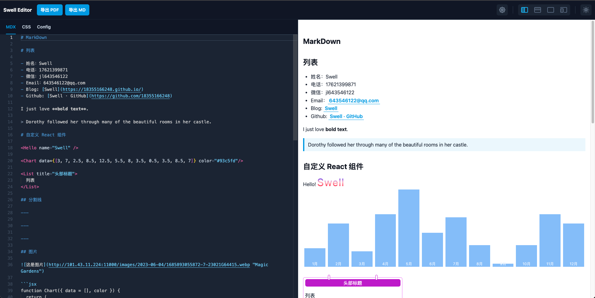

# 开发一套 MDX 可预览编辑器

## 初衷

我们在写博客的时候, 经常使用 markdown 语法书写, 再通过线上的播客网站转化成 html 页面, 渲染出好看的文章, 但是市面上好用且可定制化的编辑器少之又少, 且不完全满足开发的需求, 所以想自己开发一套用于使用

## 目标

1. 支持编辑和预览
2. 支持编辑预览区范围的拖拽, 支持编辑预览区域布局修改
3. 支持白天, 夜间模式的切换
4. 支持预览区域设置成手机模式, 且可以自定义宽高
5. 支持 MDX, 可以自定义 React 组件
6. 支持 css, 可以自定义样式
7. 拓展预览区域的整体主题切换, 支持代码块的主题切换
8. 支持导出功能
9. 支持打包成桌面端

## 框架

- 脚手架 [nextjs](https://nextjs.org/), 便于后续开发服务端功能方便拖拽
- CSS [tailwindcss](https://www.tailwindcss.cn/docs/installation)
- 代码高亮 [prismjs](https://prismjs.com/docs/)
- MDX [mdxjs](https://mdxjs.com/packages/)
- 代码编辑器 [monaco-editor](https://github.com/microsoft/monaco-editor)
- 桌面端打包 [tauri](https://tauri.app/zh-cn/v1/guides/getting-started/setup/)

## 开始

这里只做整体的实现思路介绍, 某些部分的功能可能会直接带过或者贴代码展示, 具体的细节可以看源码或自行探索

因为项目中功能点较多, 如果一一描述, 篇幅较长, 所以摘取一些有难度的地方做分析

先看下预览

<video id="video" controls="" preload="none" poster="封面">
  <source id="mp4" src="./assets/demo.mov" type="video/mp4">
</videos>

### 布局



布局采用的是上下布局
顶部的组件包含左侧的标题和操作按钮, 右侧是按钮组, 包含设置, 视图切换, 白天夜间切换
下面的部分包含左侧的代码编辑区和右侧的预览区域
左侧的代码编辑区, 支持 tab 切换, 包含 MDX,CSS,JSX 的编辑

编辑区的视图切换支持左右, 上下, 预览, 手机预览几种模式切换, 左右,上下拖拽功能使用的是 [react-split-pane](https://github.com/tomkp/react-split-pane), 也可以使用[allotment](https://github.com/johnwalley/allotment), 在使用 react-split-pane 过程中, 如果使用的是 react18 版本 会报错, 报错的问题也就是 typescript 的类型声明有误, 我这里采用了 [issues 解决方案 patch-package](https://github.com/tomkp/react-split-pane/issues/830) 的方式做了解决

### 代码编辑区

代码编辑这里使用了 vscode Web 版 [Monaco Editor](https://microsoft.github.io/monaco-editor/)

在左侧编辑区组件初始化的时候执行, 只执行一次

```jsx
export function createMonacoEditor({
  container,
  initialContent,
  onChange,
  onScroll,
}: CreateMonacoEditorProps) {
  const disposables: any[] = []; // 销毁列表

  window.MonacoEnvironment = {
    getWorkerUrl: (_moduleId, label) => {
      const v = `?v=${
        require("monaco-editor/package.json?fields=version").version
      }`;
      if (label === "css" || label === "tailwindcss")
        return `_next/static/chunks/css.worker.js${v}`;
      if (label === "html") return `_next/static/chunks/html.worker.js${v}`;
      if (label === "typescript" || label === "javascript")
        return `_next/static/chunks/ts.worker.js${v}`;
      return `_next/static/chunks/editor.worker.js${v}`;
    },
  };

  // 覆盖默认的格式化功能, 使用 prettier 替代
  disposables.push(registerDocumentFormattingEditProviders());

  // 设置 markdown 的 模型 用来生成预览
  const html = setupMarkdownMode(
    initialContent.html,
    () => {
      onContentChange();
    },
    () => editor
  );
  disposables.push(html);
  // 设置 css 的 模型 用来生成预览
  const css = setupCssMode(
    initialContent.css,
    () => {
      onContentChange();
    },
    () => editor
  );
  disposables.push(css);
  // 设置 js 的 模型 用来生成预览
  const config = setupJavascriptMode(
    initialContent.config,
    () => {
      onContentChange();
    },
    () => editor
  );
  disposables.push(config);

  // 配置主题
  initMonacoTheme();

  // 初始化编辑器
  const editor = monaco.editor.create(container, {
    theme: getTheme() === "dark" ? "dark" : "light",
    wordWrap: "on", // 文本换行配置
    lineHeight: monacoConfig.lineHeight,
    fontSize: monacoConfig.fontSize,
    minimap: {
      enabled: false, // 隐藏
    },
    fixedOverflowWidgets: true, // 我的编辑器整体宽度较小，而提示项的宽度较大，导致提示框的一部分被覆盖。查了一下issues，没有直接把提示框限定在编辑器范围内的配置项。但有一个相关的配置项，设置为true后，可以把隐藏的部分显示出来
    unicodeHighlight: {
      ambiguousCharacters: false, // 取消 unicode ASCII编码 字符串高亮问题
    },
  });

  disposables.push(editor);

  // 初始化快捷键
  initKeyBindings(editor);

  // 设置 ctrl+s 快捷键 = 格式化代码
  updateKeyBinding(
    editor,
    "editor.action.formatDocument",
    monaco.KeyMod.CtrlCmd | monaco.KeyCode.KeyS
  );

  // 监听编辑器滚动事件, 获取滚动代码的 startLineNumber 用于右侧预览区同步滚动
  editor.onDidScrollChange((e) => {
    if (!e.scrollTopChanged) return;
    const currentModel = editor.getModel();
    if (currentModel === html.getModel()) {
      const { startLineNumber } = editor.getVisibleRanges()[0];
      onScroll(startLineNumber);
    }
  });

  // 整合模型
  const models = { html, css, config };

  return {
    editor,
    models,
    dispose: () => {
      disposables.forEach((disposable) => disposable.dispose());
    },
  };
}
```

#### 这里我们说下如何 覆盖默认的格式化功能, 使用 prettier 替代

1. 使用 [monaco.languages.registerDocumentFormattingEditProvider 6421 行 ](https://microsoft.github.io/monaco-editor/node_modules/monaco-editor/monaco.d.ts) 覆盖默认的格式化功能

以 markdown 为例

```js
monaco.languages.registerDocumentFormattingEditProvider(
  "markdown",
  formattingEditProvider
);

const formattingEditProvider = {
  // 固定格式
  async provideDocumentFormattingEdits(
    model: monaco.editor.ITextModel,
    options: monaco.languages.FormattingOptions,
    _token: monaco.CancellationToken
  ) {
    if (!prettierWorker) {
      // 新建 web worker
      prettierWorker = createWorkerQueue(PrettierWorker)
    }
    // src/workers/prettier.worker.js 内部初始化
    // emit 是在 src/utils/workers.ts 配置
    const { canceled, error, pretty } = (await prettierWorker.emit({
      text: model.getValue(),
      language: model.getLanguageId(),
    })) as any
    if (canceled || error) return []
    return [
      {
        range: model.getFullModelRange(),
        text: pretty,
      },
    ]
  },
}
```

createWorkerQueue

```js
// 生成执行队列
export function createWorkerQueue(NewWorker: WebpackWorker) {
  // 本地有跨域问题
  // const worker = new Worker(new URL(workerPath, import.meta.url))
  const worker = new NewWorker();
  const queue = new PQueue({ concurrency: 1 });
  return {
    worker,
    emit(data: any) {
      queue.clear();
      const _id = Math.random()
        .toString(36)
        .substring(2, 5);
      worker.postMessage({ _current: _id });
      return queue.add(
        () =>
          new Promise((resolve) => {
            function onMessage(event: any) {
              if (event.data._id !== _id) return;
              worker.removeEventListener("message", onMessage);
              resolve(event.data);
            }
            worker.addEventListener("message", onMessage);
            worker.postMessage({ ...data, _id });
          })
      );
    },
    terminate() {
      worker.terminate();
    },
  };
}
```

我们看下 prettierWorker 初始化了什么

```js
import prettier from "prettier/standalone";

// 格式化代码
const options = {
  markdown: async () => ({
    parser: "markdown",
    plugins: [await import("prettier/parser-markdown")],
    printWidth: 10000,
  }),
};

let current;

addEventListener("message", async (event) => {
  if (event.data._current) {
    current = event.data._current;
    return;
  }

  function respond(data) {
    setTimeout(() => {
      if (event.data._id === current) {
        postMessage({ _id: event.data._id, ...data });
      } else {
        postMessage({ _id: event.data._id, canceled: true });
      }
    }, 0);
  }

  const opts = await options[event.data.language]();

  try {
    respond({
      pretty: prettier.format(event.data.text, opts),
    });
  } catch (error) {
    respond({ error });
  }
});
```

执行步骤

1. 首先使用 monaco 注册覆盖对应语言的 format 方法
2. 使用 createWorkerQueue 传入 PrettierWorker 注册一个 worker
3. createWorkerQueue 返回的参数调用 emit 方法调用 worker.postMessage 并监听 message
4. emit 的 worker.postMessage 触发 PrettierWorker 的 addEventListener("message"), 调用 prettier 的 format 方法格式化指定的语言代码 将格式化代码 pretty 通过 postMessage 传回给 createWorkerQueue 的监听方法 message, 再通过 emit 成功回调传递给 formattingEditProvider
5. monaco 的 format 方法拿到格式化结果按格式返回 渲染到编辑器中

至此, 实现了覆盖 monaco 编辑器默认的格式化代码行为

### 预览区

预览区要处理的工作比较多

1. 引入 mdx, 支持将左侧的代码通过 mdxjs 编译成html代码块
2. 支持 md 的额外功能, 包括表格, 数学符号, 代码块主题, react组件渲染
3. css样式的加载
4. 手机模式的预览和可拖拽控制宽高

